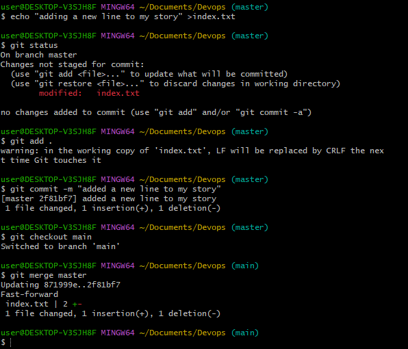

# Git ProJect
# Initializing Repository and making commits.
To create a new repo, you'll use the git init command. git init is a one-time command you use during the initial setup of a new repository Executing this command will create a new .git subdirectory in your current working directory. This will also create a new main branch. 

# Git Commit
The git commit command captures a snapshot of the project's currently staged changes. Committed snapshots can be thought of as “safe” versions of a project

# Branch
Git branches are effectively a pointer to a snapshot of your changes. When you want to add a new feature or fix a bug—no matter how big or how small—you spawn a new branch to encapsulate your changes.

# Listings Your Branches
To see local branches, run this command: git branch.

# Changing Branches
Once created you can then use git checkout new_branch to switch to that branch

# Merging Vranches
use git checkout to switch to the branch you want to merge into. This branch is typically the main branch. Next, use git merge and specify the name of the other branch to bring into this branch.

# Pushing Local Repository To Remote Repository

To push your local changes to the remote repository, in the repository bar, click Push origin.
If there are commits on the remote branch that you don't have on your local branch, GitHub Desktop prompts you to fetch new commits from the remote

# Cloning Remote Repository
To clone a Git repository, you will first copy the remote URL from your repository hosting service—in this case GitHub. You will then use the Git clone command followed by the remote repo's URL

# Branch management and tagging

Tags are used as markers for significant points in the project timeline

